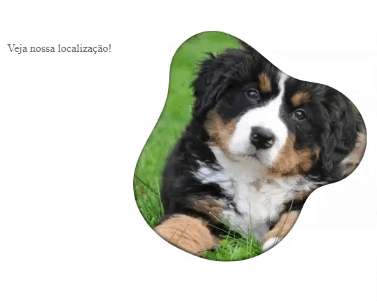

# Animação Localização
Esse é um projeto criado em sala de aula, com o intuito de fazer uma animação, utilizando CSS e HTML, essa animação é para tornar uma imagem em uma localização do maps, quando se passa o cursor em cima, tornando o site mais dinâmico.

## 🚀 Começando

Consulte **[o Codepen](https://codepen.io/AnaZenith/pen/MWdwQWM)** para visualizar o projeto.

### 📋 Pré-Visualização

Gif:

---
⌨️ com ❤️ por [Ana Laura Lis](https://gist.github.com/oliveirazenith) 😊
